# BakingApp

Baking app is an app for making baking recipes , it has been developed for **Google Android NanoDegree Program**.
Main features of this realese are:
* Abllitiy to show some baking recipes provided from Udacity’s resident baker-in-chief, Miriam.
* Ability to read more information about available recipes include (Ingredients and Steps).
* Ability to watch video for recipes steps inside the app and in  **Full Screen mode**
* Full support for Landscape and Portrait oreintiation.
* Support For Tablet devices.

What External library used:
-------

* [Espresso](https://github.com/googlesamples/android-testing/tree/master/ui/espresso) , for UI test for the app.

* [Exoplayer](https://github.com/google/ExoPlayer) , for watching recipe movies inside the app.

* [Parcel](https://github.com/johncarl81/parceler) , to serialize Objects between Contexts and activity.

* [ButterKnife](http://jakewharton.github.io/butterknife/), for view injection.

* [Glidev4](http://bumptech.github.io/glide/doc/getting-started.html), for loading and fetching photos.

* [Volley](https://developer.android.com/training/volley/index.html), for network requests.

* [Gson](https://github.com/google/gson) , for JSON Parsing.

Useful links:
-------

* [Testing](https://developer.android.com/training/testing/fundamentals), for android testing fundamentals. 

SnapShots from the app:
-------
* Phone Screens (Portrait):

  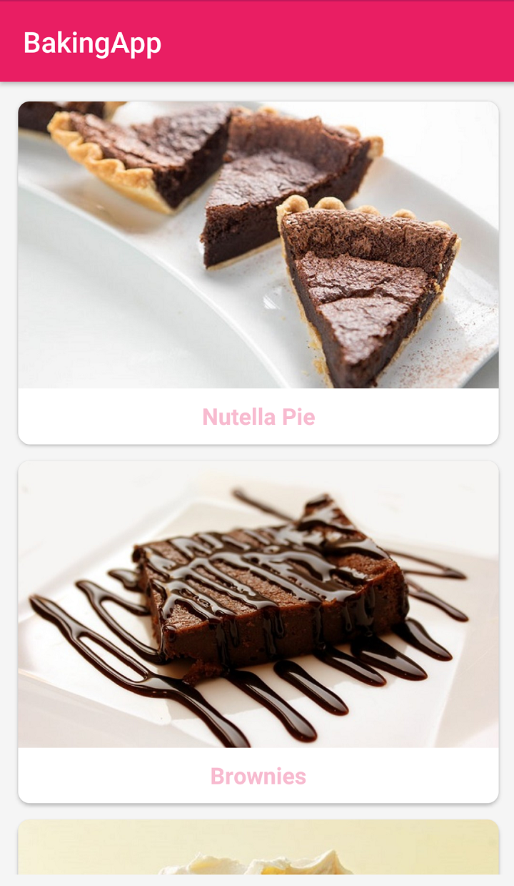  
  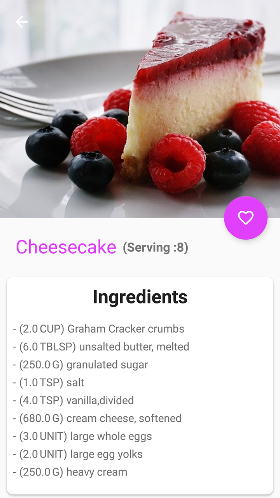 
  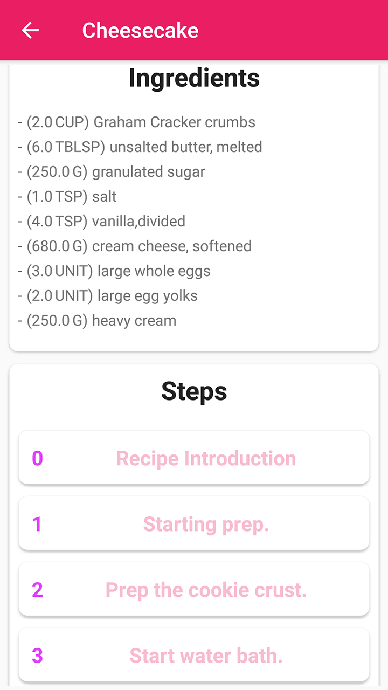 
  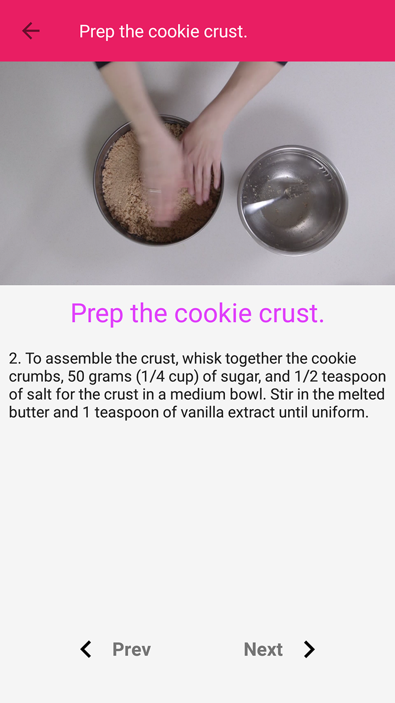 

* Phone Screens (Landscape):

  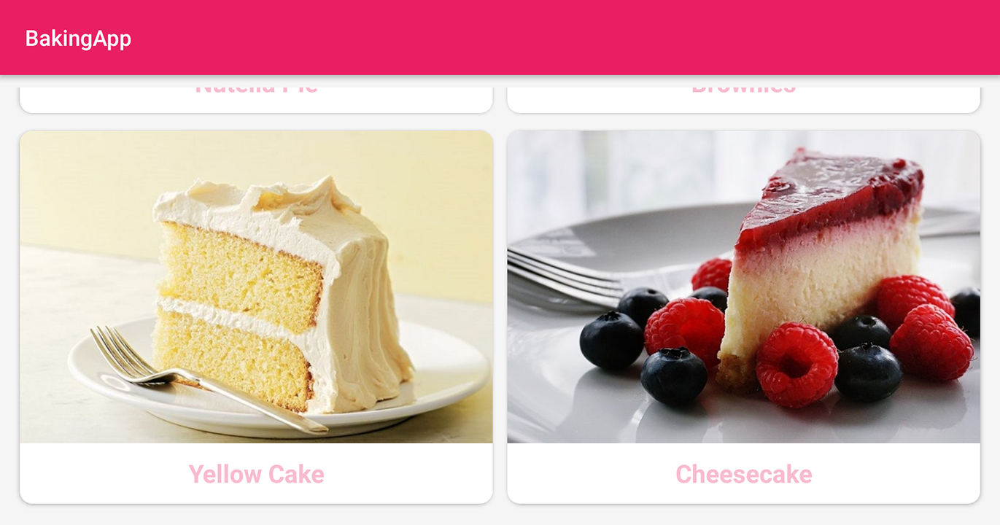

 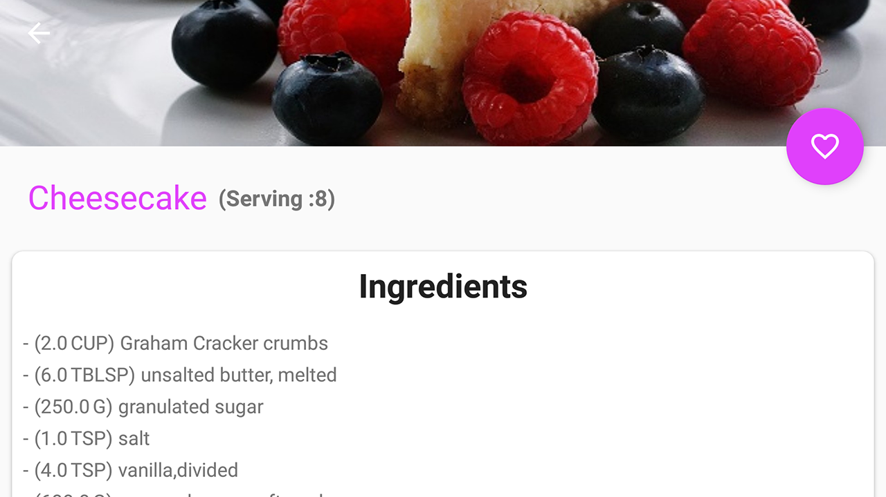

 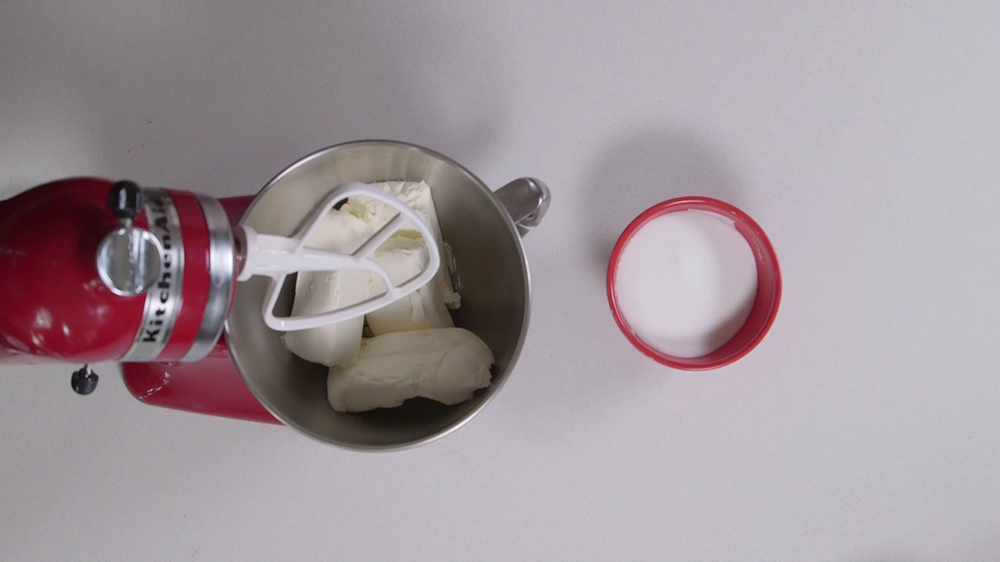

* No Internet and Widget Screen:

  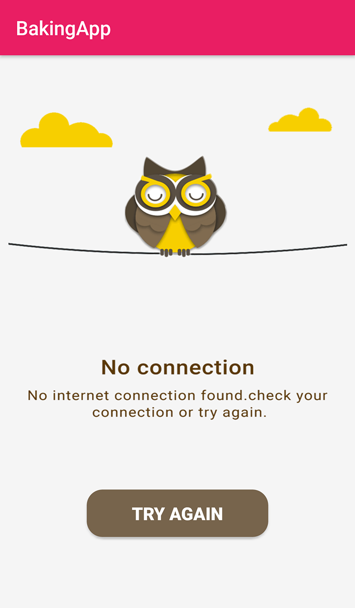
  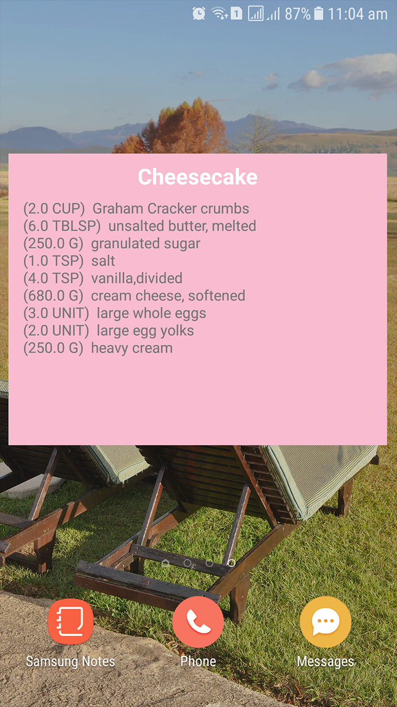

* Tablet Screens:

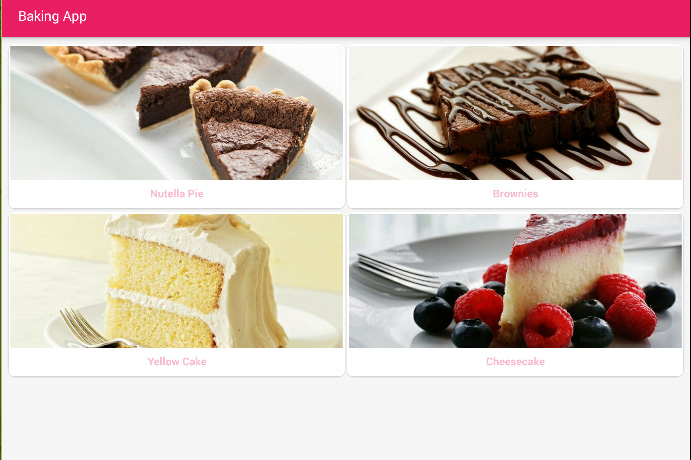

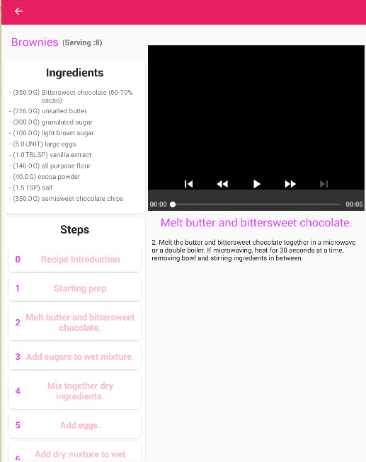

